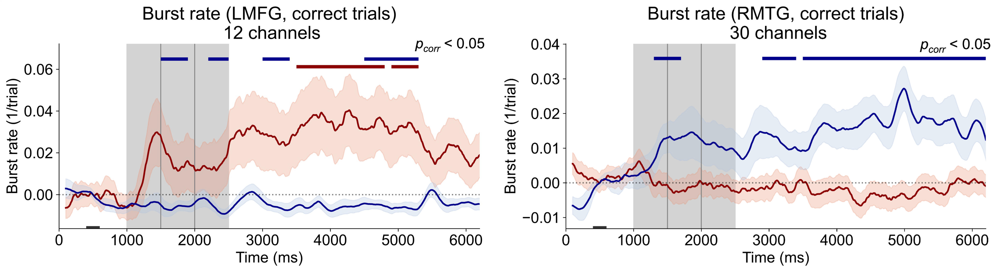

# Frontotemporal bursting supports human working memory

> Omelyusik, Vladimir, Tyler S. Davis, Satish S. Nair, Behrad Noudoost, Patrick D. Hackett, Elliot H. Smith, Shervin Rahimpour, John D. Rolston, and Bornali Kundu. ["Frontotemporal bursting supports human working memory."](https://www.sciencedirect.com/science/article/pii/S1053811926000364) NeuroImage (2026): 121718.



## Requirements

- The dataset can be downloaded from OpenNeuro: [doi.org/10.18112/openneuro.ds006136.v1.0.0](https://doi.org/10.18112/openneuro.ds006136.v1.0.0)
- Python 3.10 and MATLAB_R2024b. 
- Python dependencies specified in `requirements.txt`.
- [`burst_toolbox`](https://github.com/V-Marco/burst_toolbox) package, using commit `bc43e00`.

## Results

- Human WM is associated with bursting in LMFG and RMTG (Figure 2 and 3): [figure_23.ipynb](figure_23.ipynb)
- Burst rates in LMFG and RMTG differentiate WM performance (Figure 4): [figure_4.ipynb](figure_4.ipynb)
- LMFG and RMTG are linked through phase-burst coupling (Figure 5): [figure_5.ipynb](figure_5.ipynb)

Sample MATLAB scripts for estimating 1D and 2D GLME and ANOVA can be found in `matlab_scripts/`.

## Cite

If you use the code from this repository in your work, please consider citing the associated publication:
```
@article{OMELYUSIK2026121718,
title = {Frontotemporal bursting supports human working memory},
journal = {NeuroImage},
volume = {327},
pages = {121718},
year = {2026},
issn = {1053-8119},
doi = {https://doi.org/10.1016/j.neuroimage.2026.121718},
url = {https://www.sciencedirect.com/science/article/pii/S1053811926000364},
author = {Vladimir Omelyusik and Tyler S. Davis and Satish S. Nair and Behrad Noudoost and Patrick D. Hackett and Elliot H. Smith and Shervin Rahimpour and John D. Rolston and Bornali Kundu},
keywords = {Bursting, Working memory, Beta, Gamma, Intracranial EEG}
}
```

